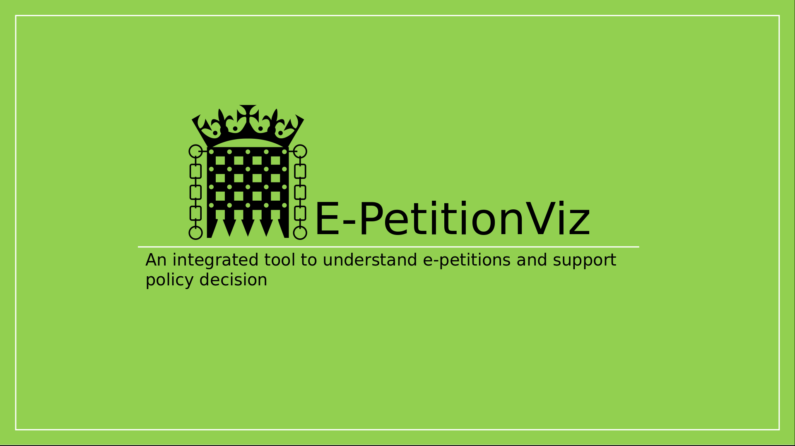
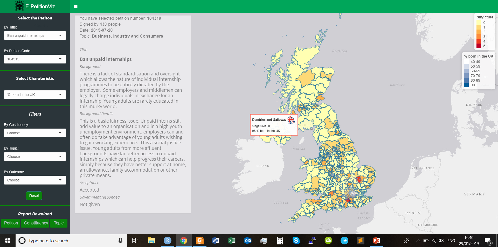
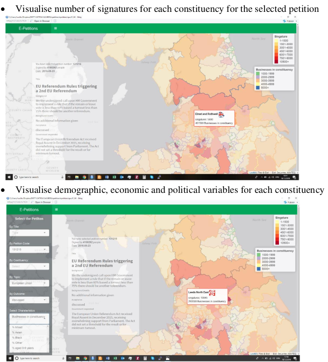

# EpetitionViz
## EpetitionViz: An integrated tool to understand e-petitions and support policy decision

Since its creation in 2015, the UK Parliament’s e-petitions platform has received over 30
thousand petitions from the public varying from crime to health services. Currently, the
petitions data is not linked with the wealth of additional information (e.g. average income,
demographics, election outcomes etc.) available for constituencies from official government
sources.
Here I suggest a tool that integrates this information in a meaningful and visually accessible
way and that allows practitioners to make the best use of existing information.

**What it is:**

E-PetitionViz is a visualisation tool to integrate in real time e-petition data and external
demographic, socio-economic and political data. It allows to explore to what extent various
constituencies are engaged with various types of e-petitions in terms of signatures and to
understand whether certain constituencies characteristics (e.g. affluent vs. deprived) are
mirrored in the e-petitions (topics, successful vs. unsuccessful).

